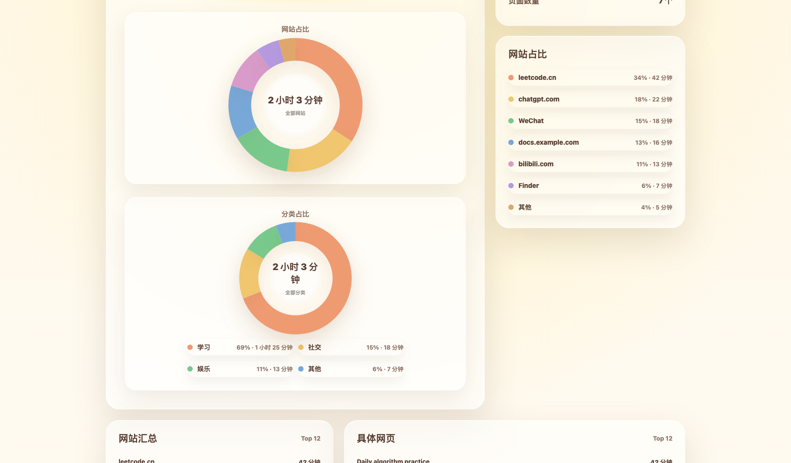
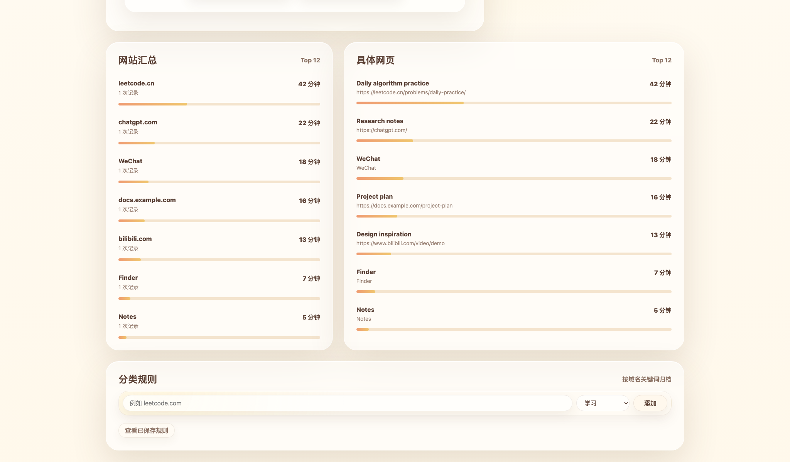

<div align="center">

# OrbitLog

### A local-first macOS time journal for websites and apps

Turn your browsing and app activity into readable daily, weekly, and monthly reports without sending your history to a cloud service.


[English](README.md) | [简体中文](README.zh-CN.md)

</div>

---

OrbitLog watches your active browser tab or frontmost app, turns it into daily / weekly / monthly summaries, and keeps everything on your own machine. It is built for people who want a readable record of where their time went without handing browsing data to a third-party service.

> OrbitLog is beta software. It works well for technical macOS users, while packaging, permission guidance, and browser coverage are still being polished.

## Preview


| Website and category charts | Website and page summaries |
| --- | --- |
|  |  |

> A short demo GIF is planned. See [Screenshot Checklist](docs/SCREENSHOTS.md) for the recording plan.

## Highlights

- **Local-first by default**: activity is stored in a local SQLite database under `data/activity.sqlite`.
- **Website and app tracking**: supported browsers include Safari, Chrome, Edge, Brave, Arc, and Chromium.
- **Readable reports**: export Markdown reports with daily, weekly, and monthly summaries.
- **Manual category rules**: classify unknown websites or apps into learning, entertainment, social, or other.
- **Desktop companion prompt**: a lightweight always-on-top classification window works outside the dashboard.
- **Warm dashboard UI**: browse time by day, week, month, website, page, and category.

## Why OrbitLog?

Most time trackers are either too broad, too opaque, or too cloud-dependent. OrbitLog is intentionally small:

- It focuses on the websites, pages, and apps you actually touch.
- It keeps the raw data on your machine.
- It exports human-readable Markdown instead of locking reports inside an app.
- It lets you classify activity manually instead of guessing with AI.
- It works as a local dashboard, with a tiny desktop companion only when needed.

## Who Is It For?

OrbitLog is useful if you:

- want a local record of study, work, social, and entertainment time
- write daily or weekly reviews and want Markdown-friendly summaries
- prefer local-first tools over hosted productivity dashboards
- want more detail than Screen Time without sending browsing history to a third party
- enjoy small, hackable desktop tools

## How It Works

OrbitLog runs a small local Node.js service. On macOS, it uses AppleScript to read the frontmost app and, for supported browsers, the current tab URL and title. The dashboard remains a normal local webpage at `localhost`, while the optional Tauri companion handles desktop-level prompts.

```text
macOS active app / browser tab
        ↓
Node.js local service
        ↓
SQLite activity store
        ↓
Web dashboard + Markdown export
```

## Quick Start

Requirements:

- macOS
- Node.js
- Rust toolchain, only needed for the Tauri companion or desktop build

## Download Beta

The macOS beta build is published from GitHub Releases:

[Download OrbitLog v0.1.0](https://github.com/juanjuandog/orbitlog/releases/tag/v0.1.0)

The app is not signed yet, so macOS may show an additional security prompt. For the smoothest experience today, technical users can still run OrbitLog from source.

Install dependencies:

```bash
npm install
```

Start the local dashboard:

```bash
npm start
```

Open the printed local URL, usually:

```text
http://localhost:4174
```

Start the desktop classification companion:

```bash
npm run companion
```

For more details, see the [Setup Guide](docs/SETUP.md).

## Build Desktop App

Development mode:

```bash
npm run desktop
```

Production build:

```bash
npm run desktop:build
```

Typical macOS outputs:

```text
src-tauri/target/release/bundle/macos/OrbitLog.app
src-tauri/target/release/bundle/dmg/OrbitLog_0.1.0_aarch64.dmg
```

## macOS Permissions

OrbitLog needs macOS permission to inspect the current foreground app and browser tab.

If the dashboard shows a read error, open:

```text
System Settings > Privacy & Security
```

Then grant the terminal or app you use to run OrbitLog:

- Accessibility
- Automation

## Supported Browsers

Current URL detection works for:

- Safari
- Google Chrome
- Microsoft Edge
- Brave Browser
- Arc
- Chromium

Firefox needs an extension or another integration path and is not supported yet for precise URL detection.

## Privacy

OrbitLog is designed as a local-first tool:

- No account is required.
- No cloud service is used.
- No browsing data is uploaded by the app.
- Activity data is stored locally in SQLite.
- Ignore rules can skip sensitive domains such as banking, email, and password-related sites.

See [Privacy](docs/PRIVACY.md) for more detail.

## Known Limitations

- macOS only for now.
- Browser URL reading depends on macOS Automation permission.
- Some full-screen apps or multi-monitor setups may affect where the companion prompt appears.
- Sleep, wake, and idle detection are handled defensively, but edge cases may still create small timing errors.
- Windows support would require a separate active-window and browser URL implementation.

## Roadmap

- [x] Local dashboard
- [x] SQLite storage
- [x] Daily / weekly / monthly views
- [x] Markdown export
- [x] Manual category rules
- [x] Desktop companion prompt
- [x] Public README screenshots
- [ ] Short demo GIF
- [ ] Signed macOS beta release
- [ ] Better first-run permission guidance
- [ ] Safer backup / reset tools for local data
- [ ] Optional browser extension support for Firefox
- [ ] Windows support through native foreground-window tracking

## FAQ

### Does OrbitLog upload my browsing history?

No. OrbitLog stores activity locally in SQLite and does not include a hosted sync or analytics service.

### Why does macOS ask for permissions?

OrbitLog needs Accessibility and Automation permissions to read the frontmost app and supported browser tab metadata. Without those permissions, it cannot reliably detect the current website.

### Does it support Windows?

Not yet. The current tracker uses macOS AppleScript. Windows support would need a separate native foreground-window and browser integration.

### Can it read Firefox URLs?

Not yet. Firefox usually needs a browser extension or another integration path for reliable URL detection.

### Where is my data stored?

Activity data is stored in `data/activity.sqlite`. Local settings are stored in `data/settings.json`.

## Development

Useful commands:

```bash
npm start
npm run companion
npm run desktop
npm run desktop:build
```

The main files are:

- `server.js`: local tracker service, SQLite storage, summaries, Markdown export.
- `public/`: web dashboard and companion prompt UI.
- `src-tauri/`: Tauri companion and desktop wrapper.

## License

MIT
